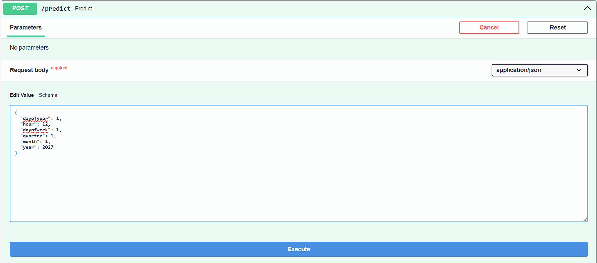
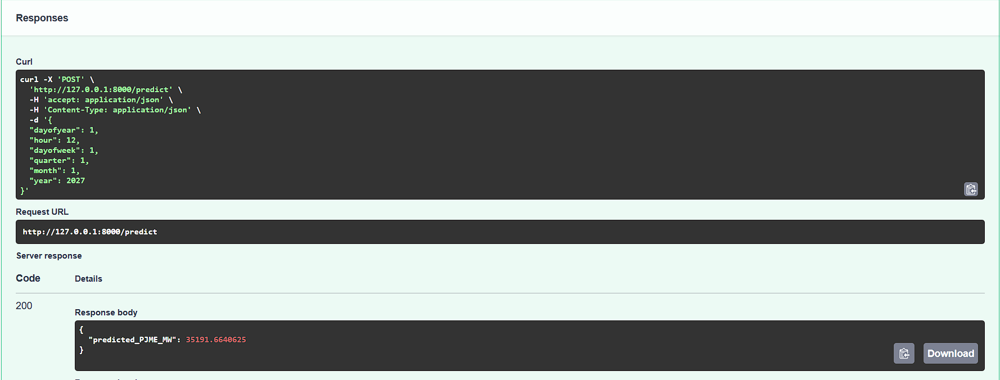

# PJME Energy Load Forecasting

## Overview
This project demonstrates an end-to-end machine learning workflow for forecasting hourly electricity demand in the PJM East (PJME) region.

The focus goes beyond model accuracy to include clean data processing, reproducible feature engineering, automated testing, CI pipelines, and serving predictions through a production-ready API.

---

## Business Context
Accurate electricity demand forecasting helps energy providers:
- Improve operational planning
- Reduce over- or under-supply risks
- Support data-driven decision-making

This project shows how machine learning can be applied in a structured and scalable way to support these goals.

---

## Dataset
- **Source:** PJME Hourly Energy Consumption Data
- **Target Variable:** `PJME_MW`
- **Frequency:** Hourly
- **Index:** Datetime

---

## Project Structure
├── data/
│ └── raw/
│ └── PJME_hourly.csv
├── models/
│ └── pjme_xgb_model.pkl
├── notebooks/
│ └── exploration.ipynb
├── src/
│ ├── data/
│ │ └── load_data.py
│ ├── features/
│ │ └── build_features.py
│ └── models/
│ ├── train.py
│ └── evaluate.py
├── tests/
│ ├── test_data_loading.py
│ └── test_features.py
├── app.py
├── Dockerfile
├── requirements.txt
└── .github/workflows/ci.yml

---

## Key Steps

### 1. Data Loading
- Parse datetime index
- Ensure consistent time-based structure
- Validate inputs through unit tests

---

### 2. Feature Engineering
Time-based features extracted from the datetime index:
- Hour
- Day of week
- Day of year
- Month
- Quarter
- Year

These features capture daily and seasonal demand patterns.

---

### 3. Exploratory Analysis
- Long-term consumption trends
- Weekly and daily demand cycles
- Visual inspection of seasonality and anomalies

---

### 4. Model Training
- Model: **XGBoost Regressor**
- Objective: Regression
- Learning rate: 0.01
- Max depth: 3
- Early stopping to control overfitting

---

### 5. Evaluation
- Metric: Root Mean Squared Error (RMSE)
- Feature importance analysis
- Error analysis by date to understand weak spots

---

### 6. CI / Quality Checks
The project includes a CI pipeline that:
- Installs dependencies
- Runs linting (flake8)
- Executes unit tests
- Validates API imports
- Builds a Docker image

This ensures code quality and reproducibility.

---

### 7. Deployment
The trained model is served through a **FastAPI** application:
- REST API for real-time predictions
- Clear input schema using Pydantic
- Ready for containerized deployment

---

## Results
- The model captures daily and seasonal electricity demand patterns
- Hour and day-of-year are among the most influential features
- Predictions closely follow real consumption trends on unseen data

---

## Technologies Used
- Python 3.10
- Pandas & NumPy
- Matplotlib & Seaborn
- Scikit-learn
- XGBoost
- FastAPI
- Docker
- GitHub Actions (CI)

---

## Install dependencies
python -m pip install -r requirements.txt

---

## Start the FastAPI server
python -m uvicorn app:app --reload

---

## Open API documentation
http://127.0.0.1:8000/docs

---

## Swagger UI
### Input

### Output

